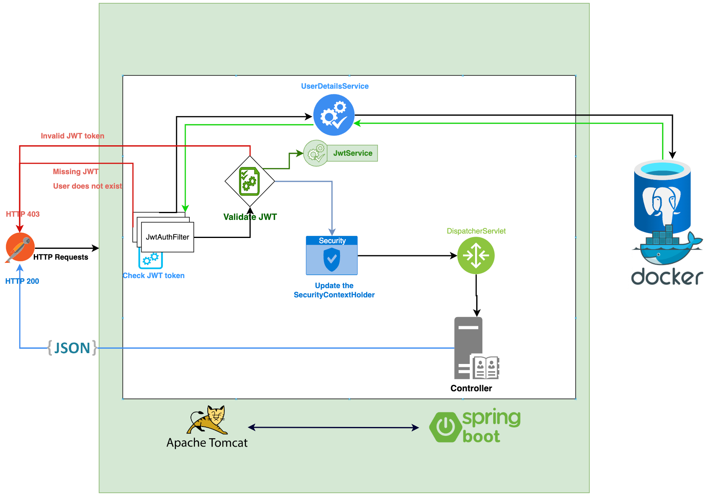
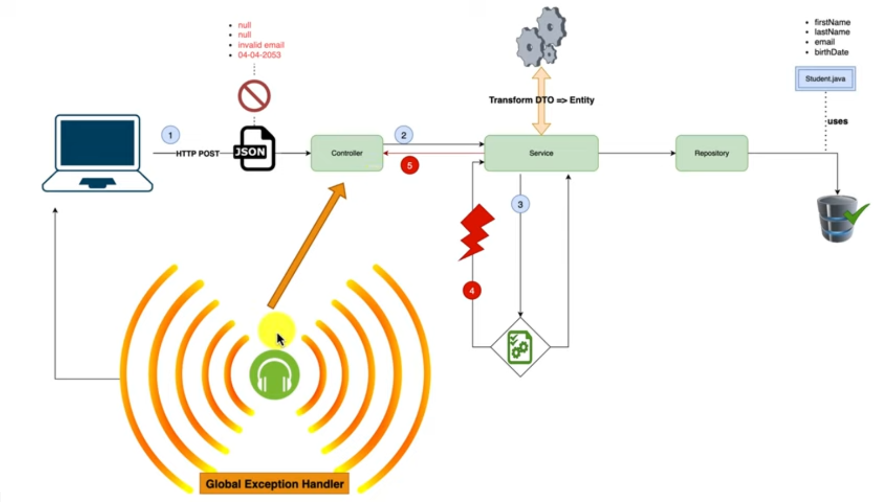

# JWT

### Security Context Holder

- It is is a central class that provides access to the **security context** of the current thread. 
- The security context contains information about the current authenticated user, such as their username, roles, and authorities.
- The ``SecurityContextHolder`` provides static methods for getting and setting the current **SecurityContext** for the current thread.


```java
// getAuthentication() is called to get the Authentication object for the current user.
Authentication authentication = SecurityContextHolder.getContext().getAuthentication();

if (authentication != null && authentication.isAuthenticated()) {
    // User is authenticated, do something here
} else {
    // User is not authenticated, do something else
}

```

### Security Configuration
// todo


### Authentication Architecture


<br>

### Exception Handling Architecture
